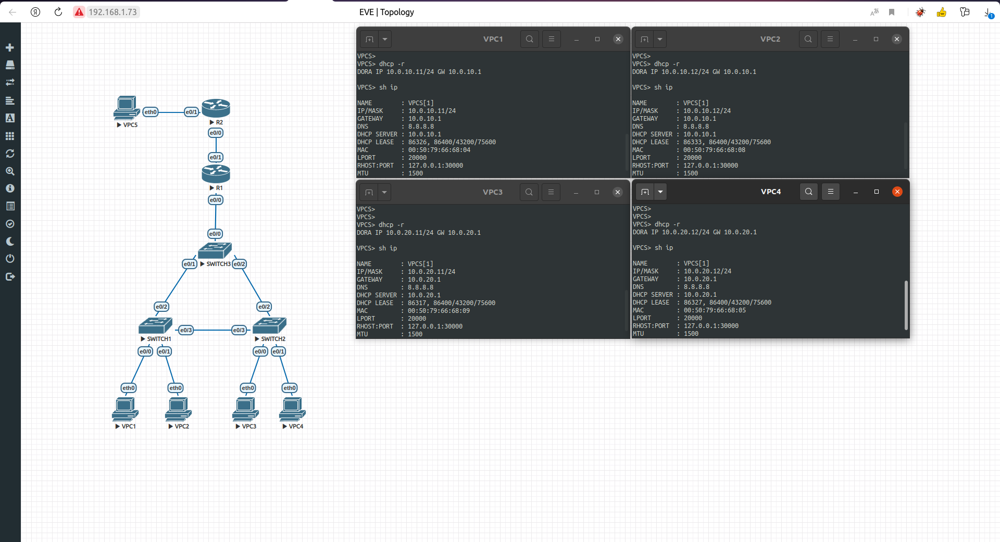
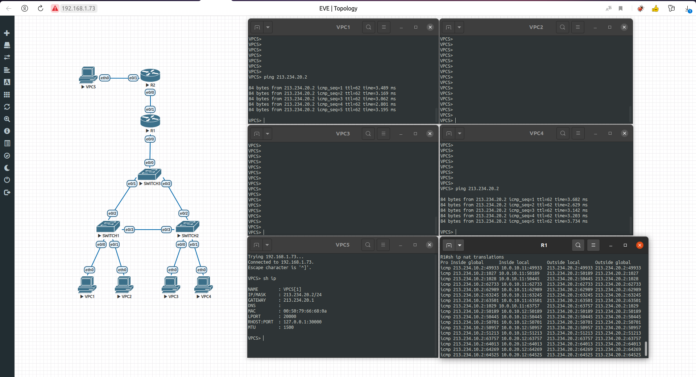

# Краткий обзор

В решении в каждом влане я разместил по 2 VPC, чтобы проверить корректное выделение IP адресов DHCP сервером, также можно считать, что R2 осуществляет глобальный интернет, а VPC5 - какой-то ресурс, к которому мы получаем доступ, используя NAT.

В качестве NAT я настроил по сути PAT, так как кажется в данной конфигурации мы хотим выходить в интернет с 1го белого IP, поэтому лучше всего подходит PAT, также он хорошо масштабируется, по сути дополнительной конфигурации на VPC, добавляемых во VLAN_10, VLAN_20 не требуется.

DHCP сервер по умолчанию отдает в качестве шлюза по умолчанию себя, те адрес роутера R1 в соответствующей подсети, а в качестве DNS - 8.8.8.8 - DNS Google.

# Работа DHCP сервера

# Ping в корпоративной сети

# Ping во внешний интернет

# Конфигурация Маршрутизатора

# Конфигурация STP для vlan 10

# Конфигурация STP для vlan 20

