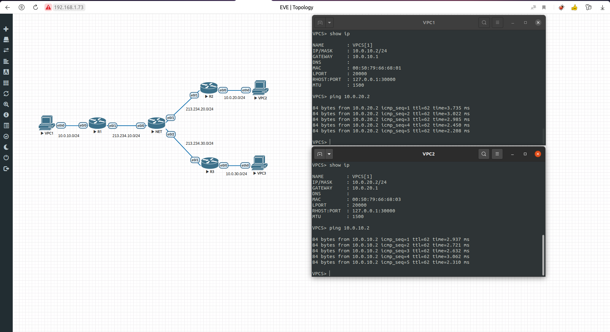
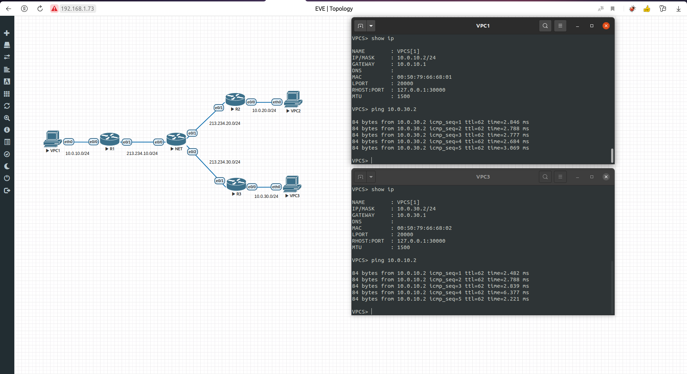
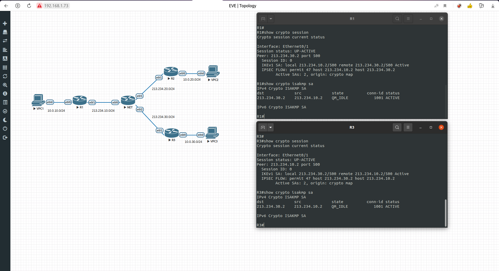
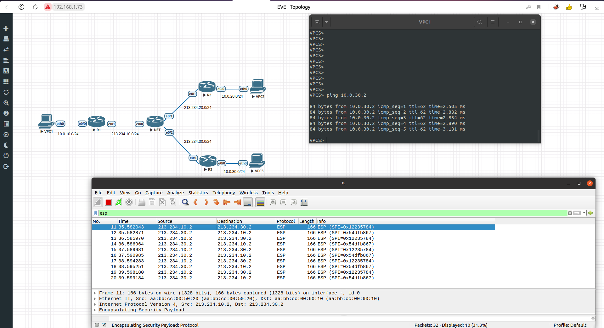
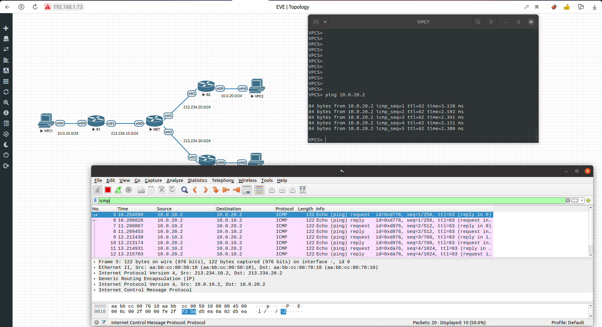

# Краткий обзор

Для построения GRE over IPSEC VPN тунеля я использовал аутентификацию с обменом ключей. На маршрутизаторе R1 поднимается 2 тунеля:
- Чистый GRE
- GRE over IPSEC

для каждого из них я сделал дополнительный статический маршрут во входящий виртуальный интерфейс тунеля, чтобы перенаправлять трафик на другой конец по нужному IP удаленной подсети.

# Ping GRE

# Ping GRE over IPSEC

# IPSEC info

# Ping GRE over IPSEC Wireshark cast

# Ping GRE Wireshark

